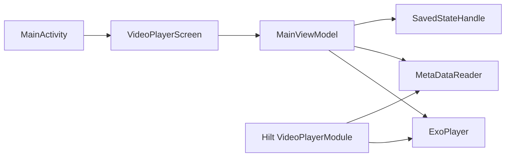

# Video Player Compose Sample

<p align="center">
  
  
  
  
  
  
</p>

A production-shaped Android sample that plays **local videos** with [AndroidX Media3](https://developer.android.com/media/media3) (ExoPlayer) and a **Compose-first** UI.

Pick files from device storage, build a playlist, and play them with Material 3 controls — without wrapping `PlayerView` in `AndroidView`.

---

## Highlights

- **Compose-native playback** via `media3-ui-compose-material3` (`Player` composable, shutter, progress, play/pause)
- **ExoPlayer** provided with Hilt at ViewModel scope and released with the ViewModel
- **SAF picker** (`OpenDocument`) with persistable read permission so URIs survive process death
- **Material 3** layout: edge-to-edge, dynamic color on Android 12+, playlist empty state, now-playing row
- **Modern toolchain**: AGP 9.4, Gradle 9.6, built-in Kotlin, Compose Compiler plugin, KSP instead of kapt
- **Version catalog** (`gradle/libs.versions.toml`) for a single source of truth

---

## Architecture



| Layer | Responsibility |
| --- | --- |
| `MainActivity` | Edge-to-edge host, Compose theme |
| `VideoPlayerScreen` | Player surface, playlist, SAF launcher |
| `MainViewModel` | Playlist state, playback, URI persistence |
| `VideoPlayerModule` | `@ViewModelScoped` ExoPlayer + metadata reader |
| `MetaDataReader` | Display name from `MediaStore` |

Playback pauses on `ON_STOP` so audio does not continue in the background. This sample is a **foreground local player**, not a MediaSession / notification service.

---

## Tech stack

| Component | Version |
| --- | --- |
| Android Gradle Plugin | 9.4.0 |
| Gradle | 9.6.0 |
| Kotlin | 2.3.21 (built-in Kotlin + Compose compiler plugin) |
| KSP | 2.3.11 |
| Compose BOM | 2026.08.00 |
| Media3 | 1.11.1 |
| Hilt | 2.60.1 |
| compileSdk | 37 |
| targetSdk | 36 |
| minSdk | 26 (Android 8.0) |
| JVM | 17 |

---

## Project structure

```text
app/src/main/java/com/halil/ozel/videoplayercomposesample/
├── MainActivity.kt
├── VideoPlayerApp.kt
├── data/
│   ├── MetaDataReader.kt
│   └── VideoItem.kt
├── di/
│   └── VideoPlayerModule.kt
└── ui/
    ├── MainViewModel.kt
    ├── VideoPlayerScreen.kt
    └── theme/
```

---

## Getting started

### Requirements

- Android Studio with AGP 9.4 support (for example **Android Studio Quail**)
- JDK 17 or newer for the Gradle daemon
- Android SDK Platform **37** (compile) — devices still target API 36

### Clone and run

```bash
git clone https://github.com/halilozel1903/VideoPlayerComposeSample.git
cd VideoPlayerComposeSample
./gradlew :app:assembleDebug
```

Open the project in Android Studio, connect a device or emulator (API 26+), and run the `app` configuration.

### Try the player

1. Tap the **library** FAB.
2. Choose any video from storage (not limited to MP4).
3. Tap a row in the playlist to start playback.
4. Use the on-player Material 3 controls for play, pause, and seek.

---

## How playback is wired

```kotlin
@Provides
@ViewModelScoped
fun provideVideoPlayer(app: Application): Player {
    return ExoPlayer.Builder(app).build()
}
```

The ViewModel owns the `Player`, restores the URI list from `SavedStateHandle`, and maps URIs to `MediaItem` plus a display name. The screen collects that list with `collectAsStateWithLifecycle` and renders Media3’s Compose `Player`.

---

## Build notes

- **kapt is gone.** Hilt runs through KSP.
- **Do not apply** `org.jetbrains.kotlin.android`. AGP 9 supplies built-in Kotlin.
- Keep applying `org.jetbrains.kotlin.plugin.compose` for the Compose compiler.
- Dependency versions live in `gradle/libs.versions.toml`. Bump them there first.

```bash
./gradlew help
./gradlew build --dry-run
./gradlew :app:assembleDebug
```

---

## Learning path

If you are using this repo as a tutorial, a useful order is:

1. `VideoPlayerModule` — how ExoPlayer is created and scoped  
2. `MainViewModel` — playlist + `MediaItem`  
3. `VideoPlayerScreen` — Compose UI and lifecycle pause  
4. `MetaDataReader` — reading a display name from a content URI  

Official docs:

- [Media3 Compose UI](https://developer.android.com/media/media3/ui/compose)
- [Hilt on Android](https://developer.android.com/training/dependency-injection/hilt-android)
- [Jetpack Compose](https://developer.android.com/compose)
- [AGP 9 / built-in Kotlin](https://developer.android.com/build/migrate-to-built-in-kotlin)

---

## Contributing

Issues and pull requests are welcome. Please keep changes focused (toolchain, player, UI, or docs) and match the existing Kotlin style.

---

## License

```
MIT License
Copyright (c) 2026 Halil Ozel
```

See [LICENSE](LICENSE) for the full text.

---

## Author

**Halil Ozel** — [GitHub](https://github.com/halilozel1903)
